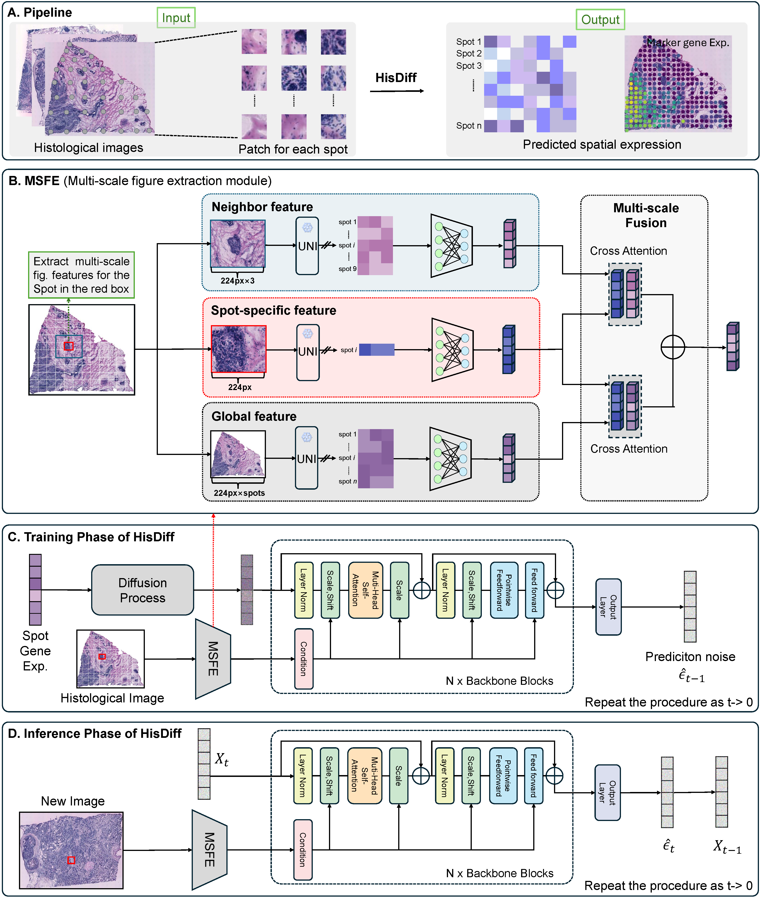

# HisDiff
## Overview
HisDiff is a novel deep learning framework designed to infer high resolution spatial gene expression profiles directly from H&E stained whole slide images. By integrating a hierarchical feature extraction module, which captures global context, neighborhood interactions, and spot specific details, with a powerful conditional diffusion framework, HisDiff effectively models the complex, one to many relationship between tissue morphology and transcriptional states. This generative approach overcomes the oversmoothing limitations of traditional regression methods, enabling the faithful recovery of biologically meaningful gene coexpression structures and functional pathways from low cost histological data.



## Installations
- NVIDIA GPU (e.g., Nvidia GeForce RTX 3090)
- 'pip install -r requirements.txt'

## Getting access
To download the datasets and perform preprocessing, you need a Hugging Face token with access to the UNI model.
1.  **Request Access**: Apply for access to the UNI model at [https://huggingface.co/mahmoodlab/UNI](https://huggingface.co/mahmoodlab/UNI).
2.  **Token Usage**: Once approved, use your Hugging Face token in:
    -   `dataset_download_hest1k.ipynb` to download the datasets.
    -   `preprocess.ipynb` to load the UNI model for feature extraction.

## Data
All the datasets used in this paper can be downloaded from url:(https://zenodo.org/records/17709073)
### Data format
- `st/`: Contains spatial transcriptomics data.
- `wsis/`: Contains original Whole Slide Images.
- `metadata/`: Contains metadata files.
### Data preprocessing
See [preprocess.ipynb](preprocess.ipynb) for the complete preprocessing pipeline

## Run HisDiff
To train the model, run `train.py` with the appropriate arguments.
### Example Usage
```bash
python train.py --expr_name Her2st --data_path ./hest1k_datasets/Her2st/ --slide_out SPA148 --results_dir ./Her2st_results/SPA148/
```

### Key Arguments
- `--expr_name`: Name of the experiment (default: "Her2st").
- `--data_path`: Path to the dataset directory (default: "./hest1k_datasets/Her2st/").
- `--slide_out`: Slide ID to exclude from training and use for testing (default: "SPA148").
- `--results_dir`: Directory to save results and checkpoints.
- `--gene_list`: File containing the list of selected genes (default: "selected_gene_list.txt").
- `--device`: GPU device to use (default: "cuda:0").

## Contact details
If you have any questions, please contact minwenwen@ynu.edu.cn.
