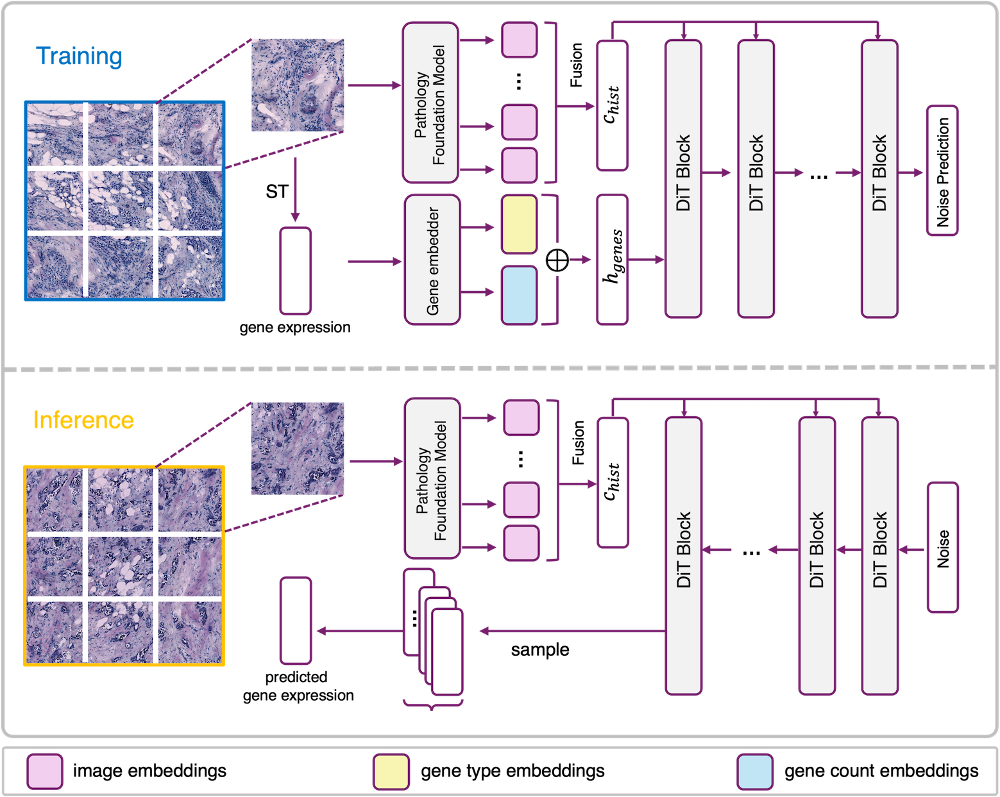
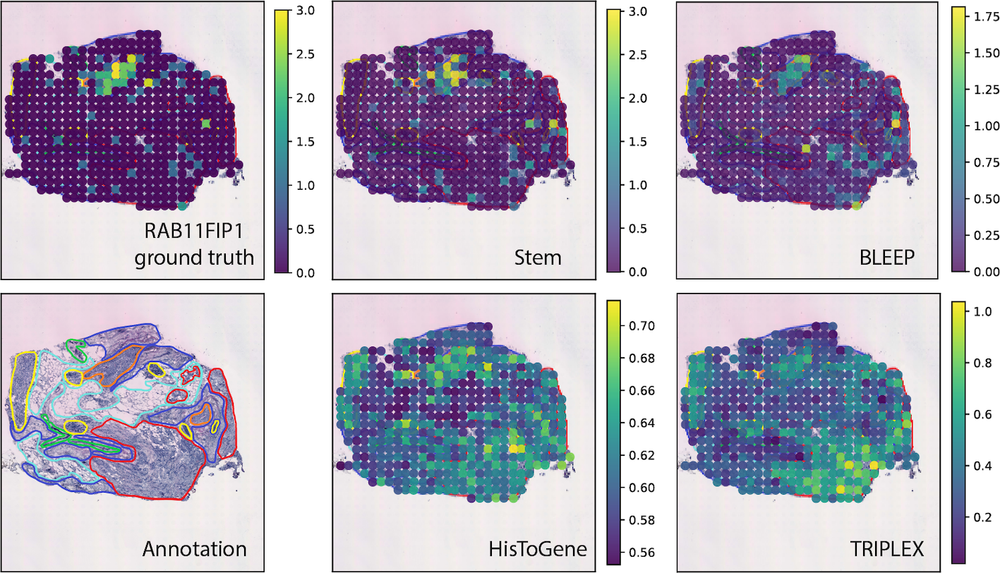

# Stem

[](https://arxiv.org/abs/2501.15598)
<!-- [](LICENSE) -->

Welcome to the official repository for **Stem** proposed in "Diffusion Generative Modeling for Spatially Resolved Gene Expression Inference from Histology Images."  



## Installation
Download this repo:
```
git clone https://github.com/SichenZhu/Stem.git
cd Stem
```
Create a new conda environment:
```
conda env create -f environment.yml
conda activate stem_env
```


## Preparing Datasets:
All the datasets used in our paper could be downloaded from the [HEST](https://github.com/mahmoodlab/HEST) database.

**Download datasets:** [dataset_download_hest1k.ipynb](dataset_download_hest1k.ipynb)

Downloaded dataset ($DATASETNAME) would be saved in the following structure with a unified file naming system formatted by HEST (only relevant folders are shown):
> - hest1k_datasets/$DATASETNAME/
>    - wsis/ (contain whole slide H&E images)
>    - st/ (contain ST h5ad data)

In this repo, the file naming system (slide ID) is inherited from HEST in the later training and sampling process. 


**Preprocess datasets:**  [dataset_preprocess.ipynb](dataset_preprocess.ipynb)

- _Extracting image patch embeddings:_ we provided preprocessing pipelines for [UNI](https://github.com/mahmoodlab/UNI/tree/main) and [CONCH](https://github.com/mahmoodlab/CONCH). To use each model, please also follow their respective installation requirements in GitHub/HuggingFace. 

- _Selecting genes of interest:_ we provided an example for gene selection in [dataset_preprocess.ipynb](dataset_preprocess.ipynb). 

Processed data would be saved in `$DATASETNAME/processed_data/`:
> - hest1k_datasets/$DATASETNAME/
>    - wsis/ (contain whole slide H&E images)
>    - st/ (contain ST h5ad data)
>    - processed_data/ (contain image patch embeddings from pathology foundation models and selected gene list)
>      - *_ebd/ (contain extracted embeddings for original image patches)
>      - *_ebd_aug/ (contain extracted embeddings for augmented image patches)
>      - selected_gene_list.txt (contains the list of selected genes, could be replaced by any gene list of interest)
>      - all_slide_lst.txt (contains all slide IDs, could be modified to determine slides that are involved in training and testing)


**Remark:** For customized ST datasets that are not downloaded from the HEST database, the simplest way to integrate them into **Stem**'s pipeline is to save H&E images into `$DATASETNAME/wsis/` and ST h5ad files into `$DATASETNAME/st/`. For a customized gene list, please put the text file of selected genes in `$DATASETNAME/processed_data/`. 

## Training and Sampling:
To train **Stem** (change the number of nodes and/or number of processes per node for multi-GPU training):
```
torchrun --nnodes=1 --nproc_per_node=1 stem_train.py [OPTIONS]
```

The following block explains the optional arguments related to the input datasets. For all optional arguments, please refer to [stem_train.py](stem_train.py). 

```
optional arguments relevant to the dataset:
  --expr_name     (str) Experiment Name. [i.e. $DATASETNAME]
  --data_path     (str) Path to the dataset. [i.e. ./hest1k_datasets/$DATASETNAME/]
  --results_dir   (str) Path to save checkpoints. 
  --slide_out     (str) Slide ID for test slide. Separated by comma if multiple hold-out slides. 
                        [i.e. any slide ID(s) in hest1k_datasets/$DATASETNAME/processed_data/all_slide_lst.txt]
  --folder_list_filename (str)
                        A txt file listing file names for all training and testing slides in the dataset.
                        [i.e.hest1k_datasets/$DATASETNAME/processed_data/all_slide_lst.txt]
  --gene_list_filename   (str)
                        A txt file listing selected genes.
                        [i.e. any slide ID(s) in hest1k_datasets/$DATASETNAME/processed_data/all_slide_lst.txt]
  --num_aug_ratio (int) Image augmentation folds.
                        [i.e. 2 indicates the augmented image patches (randomly selected) will be 2 times more than the original image patches.]
  
```


Sampling after training:
```
python stem_sample.py [OPTIONS]
```

The following block explains the optional arguments related to the test slide. For all optional arguments, please refer to [stem_sample.py](stem_sample.py). 

```
optional arguments relevant to the dataset:
--slide_out          (str)  Slide ID for one test slide. 
--gene_list_filename (str)  Same as training. 
                            A txt file listing selected genes.
```

Output file structure for one experiment (i.e. No.000):
> - $results_dir/000/
>    - checkpoints/ (contain model ckpt)
>    - samples/ (contain generated samples)
>    - log.txt


**Remark:** To use image embeddings from other pathology foundation models, please modify `assemble_dataset()` function in stem_train.py and data loading section before `main()` function in stem_sample.py.

## Evaluation:
Run [eval.ipynb](eval.ipynb) to calculate different evaluation metrics and visualize gene variation curves.

## Selected Results:
Predictions for RAB11FIP1 in HER2ST dataset (marker gene for immune enriched cancer in situ). Spot colors indicate expression levels.


## Latest Update
[Jan 22, 2025] Stem was accepted to ICLR 2025.

## BibTeX
We appreciate your citations if you find this repository helpful :)

```
@inproceedings{
zhu2025diffusion,
title={Diffusion Generative Modeling for Spatially Resolved Gene Expression Inference from Histology Images},
author={Sichen Zhu and Yuchen Zhu and Molei Tao and Peng Qiu},
booktitle={The Thirteenth International Conference on Learning Representations},
year={2025},
url={https://openreview.net/forum?id=FtjLUHyZAO}
}
```
```
@article{zhu2025diffusion,
  title={Diffusion Generative Modeling for Spatially Resolved Gene Expression Inference from Histology Images},
  author={Zhu, Sichen and Zhu, Yuchen and Tao, Molei and Qiu, Peng},
  journal={arXiv preprint arXiv:2501.15598},
  year={2025}
}
```
